## Wireframes 
## Creating the Login Page 

There's a standard way that login pages look. I want:
- an image in the background
- a floaoting box with a login form
- a logo on the top
- a space for username and password
- password is censored with the option to reveal
- forgot password option to reset password
- remember me checkbox
- button to send the form and log in 
- create account button 

I put together a quick tiled image for the background, including some items used by knitters. The items are labelled in the below image 

The image is tiled in the body, using a style tag and setting the background to repeat.

I bootstrapped a basic login form, using the references from the BS website cited below. For now, the password form has no option to view an uncensored version of the password. This will be added with Javascript later. Looks close enough to the wireframe for now.

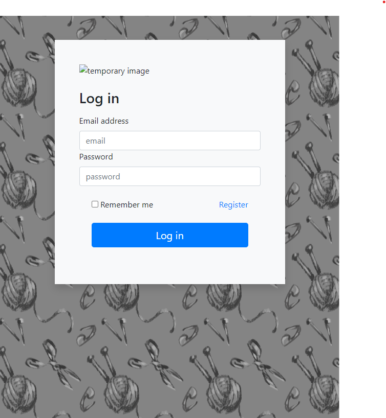
Sources:
[Background repeat](https://www.html.am/html-codes/background-code/background-repeat.cfm)
[Bootstrap Log In Sample](https://getbootstrap.com/docs/5.0/examples/sign-in/)

## Home Feed

The idea for the home feed is as follows:
- Users are placed here once they log in 
- Feed shows posts from other users
- Feed can have photos, patterns or text posts
- Feed scrolls in reverse chronological order
- Top left of this screen has the three slash symbol for a menu
- Menu opens out from screen left
- When menu is open, the feed underneath is dulled 

The menu contains the following items: 
- A search function to search all posts on site by key word
- The "patterns" option will show only pattern posts in the feed 
- The forum option is temporary, but might lead users to a forum where they can start and contribute to threads
- Friends shows the user who they follow
- My account brings the user to a screen where they can configure their account settings and manage their information

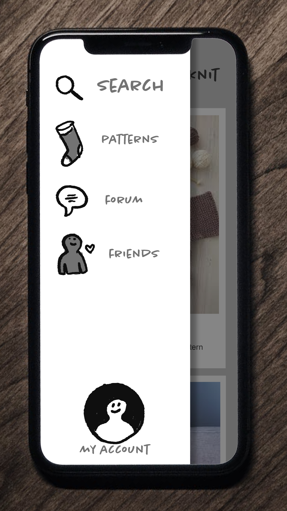
Copied HTML from login page to get header links
Removed pattern from BG and added stock bootstrap BG temporarily until Sass can be done

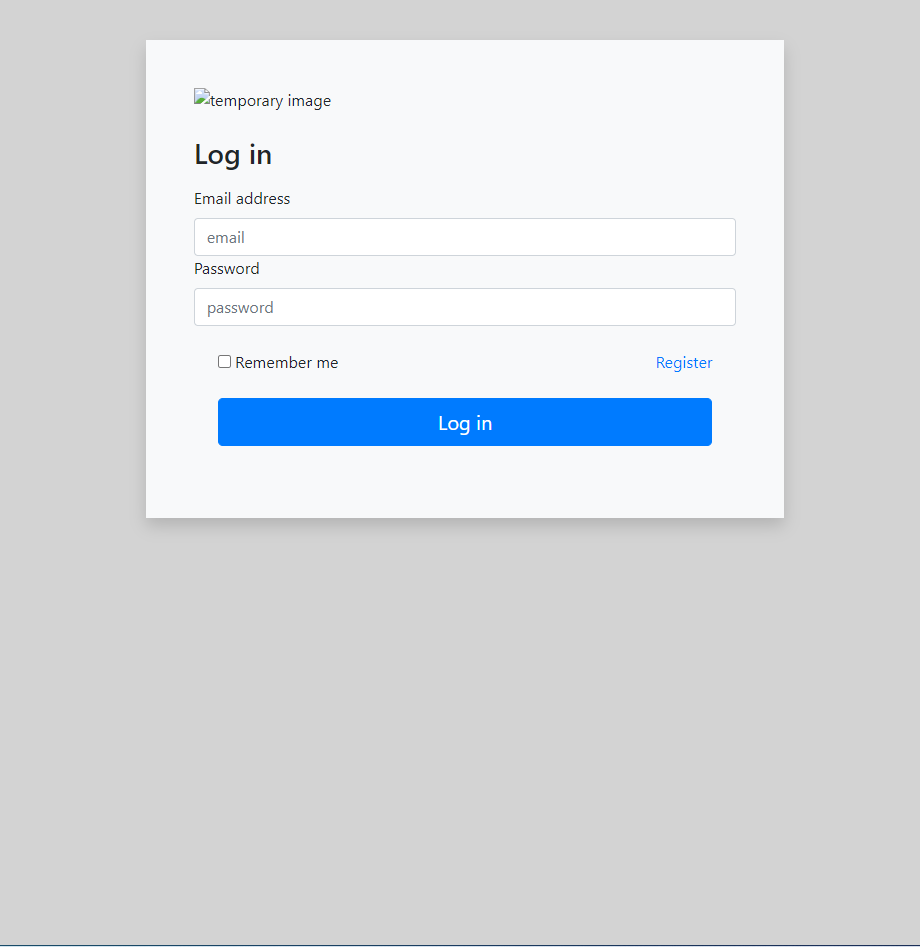

Grabbed an icon from Font Awesome, on the recommendation of the Bootstrap website 

<i class="fa-solid fa-bars"></i>

https://fontawesome.com/docs/web/setup/get-started

Decided to make my own icon instead after the weekly team meeting, people liked my sketched hand doawn icons. A nice touch would be to make these an SVG in illustrator, but I'll used a raster based icon for now 

I use a sketch pen to create a three bar icon for the menu

I add the button to the top left of the home page, with a light gray background for now. It's non functioning at the moment 
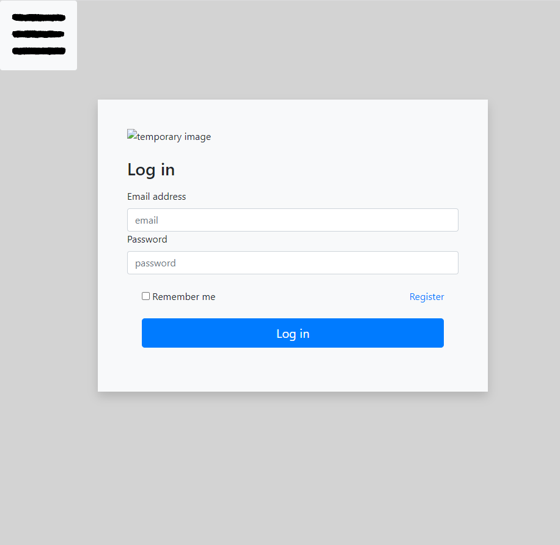

Create vertical collapsing menu using this guide 

Menu button isn't working, probably due to Javascript? 

Troubleshooting Javascript issues in the Bootstrap docs

Found JS link in the page source of this BS sample page

Putting these links into my home page and clicking on the menu shows an error in the console, indicating what's missing from my file
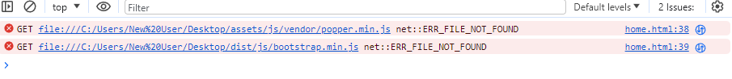

I follow this tutorial to 

Left the JS stuff for now, added nav bar and title to home page 
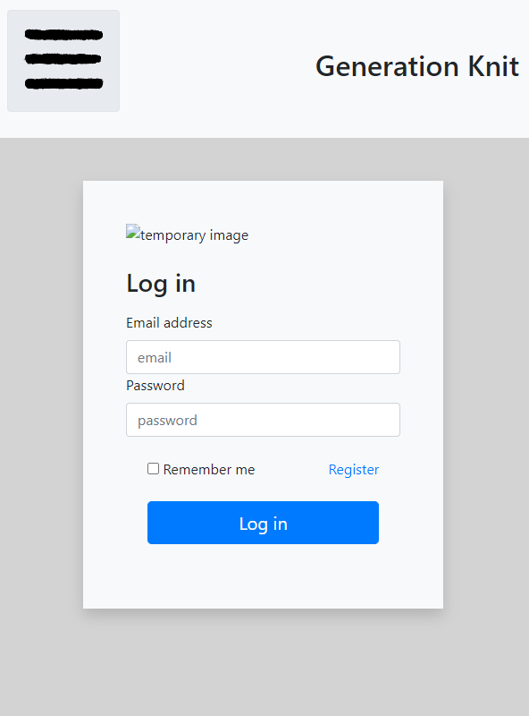

## Customising Bootstrap using SASS

## Django 

Once I got to the part of the LMS that introduced Django, I knew my fledgling project would need an overhaul. 

Source: 

I started getting a lot of errors in the bash terminal when trying to run my virtual environment. This was to do with Windows not allowing scripts to run without administrator permission. I handled it in the powershell.
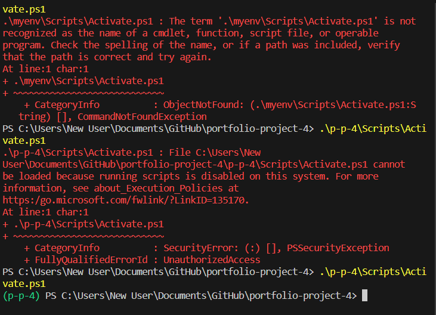
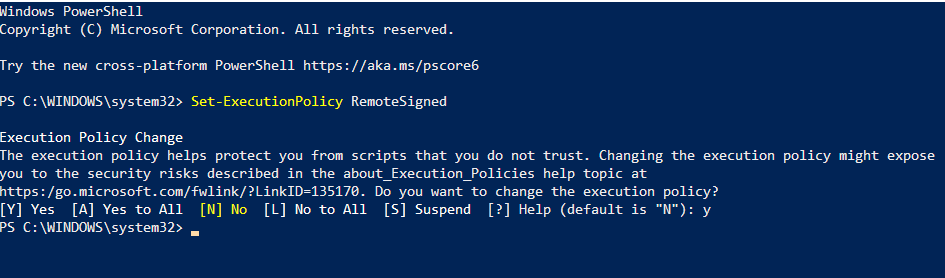

## Flask 

Followed the LMS to add Flask functionality
Note: remove debug=true from run.py before submission, change to debog=false

## Heroku Deployment 

When trying to deploy to heroku I get a fatal error that I cannot find the cause of 

Starting a new repo to try and get around this error 

*** Other README goes here ***

https://medium.com/@akshatgadodia/dockerizing-a-django-and-mysql-application-a-step-by-step-guide-d4ba181d3de5
Creating docker container

Tried creating a container from the supplied code institute docker files but there are too many codeaaywhere dependencies for it to work

Docker now up and running but still can't run the FN

Moved project to codeanywhere for linux compatibility

Set up project for deployment again but get this error when pushing to heroku

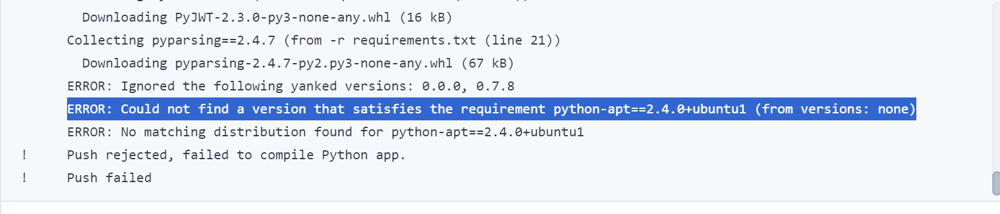

Attempt to resolve by adding "pip install -r requirements.txt" as per this stackoverflow page (https://stackoverflow.com/questions/32302379/could-not-find-a-version-that-satisfies-the-requirement-package)

This throws a new error 
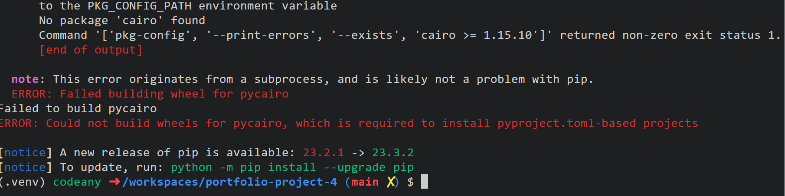
Tryig to solve using this method [https://stackoverflow.com/questions/70508775/error-could-not-build-wheels-for-pycairo-which-is-required-to-install-pyprojec]

This appear to have fixed the issue but the app still fails to build on heroku. 

Stripped all django, gunicorn, waitress out of the project to redo from scratch. 

https://learn.codeinstitute.net/courses/course-v1:CodeInstitute+FSD101_WTS+2023_Q3/courseware/16383559f48c4ae4a69e9e9149914729/d5d0251c90ab4dc5b7fc81bb7ac368d2/

- Blank django project deploys (rocket ship page)
- Hello world deploys 
- set up for heroku according to lms 
- build failed 1 "     Collecting pyparsing==2.4.7 (from -r requirements.txt (line 20))
         Downloading pyparsing-2.4.7-py2.py3-none-any.whl (67 kB)
       ERROR: Ignored the following yanked versions: 0.0.0, 0.7.8
       ERROR: Could not find a version that satisfies the requirement python-apt==2.4.0+ubuntu1 (from versions: none)
       ERROR: No matching distribution found for python-apt==2.4.0+ubuntu1
 !     Push rejected, failed to compile Python app.
 !     Push failed "
 - attempting to solve with "pip install -r requirements.txt"
 - putting the above in the terminal throws this error: 
 "  Building wheel for pycairo (pyproject.toml) ... error
  error: subprocess-exited-with-error
  
  × Building wheel for pycairo (pyproject.toml) did not run successfully.
  │ exit code: 1
  ╰─> [15 lines of output]
      running bdist_wheel
      running build
      running build_py
      creating build
      creating build/lib.linux-x86_64-cpython-310
      creating build/lib.linux-x86_64-cpython-310/cairo
      copying cairo/__init__.py -> build/lib.linux-x86_64-cpython-310/cairo
      copying cairo/__init__.pyi -> build/lib.linux-x86_64-cpython-310/cairo
      copying cairo/py.typed -> build/lib.linux-x86_64-cpython-310/cairo
      running build_ext
      Package cairo was not found in the pkg-config search path.
      Perhaps you should add the directory containing `cairo.pc'
      to the PKG_CONFIG_PATH environment variable
      No package 'cairo' found
      Command '['pkg-config', '--print-errors', '--exists', 'cairo >= 1.15.10']' returned non-zero exit status 1.
      [end of output]
  
  note: This error originates from a subprocess, and is likely not a problem with pip.
  ERROR: Failed building wheel for pycairo
Failed to build pycairo
ERROR: Could not build wheels for pycairo, which is required to install pyproject.toml-based projects"

- trying this as a solve https://github.com/pygobject/pycairo/issues/39#issuecomment-454689537
- didn't work 
- requirements.txt file looks like this 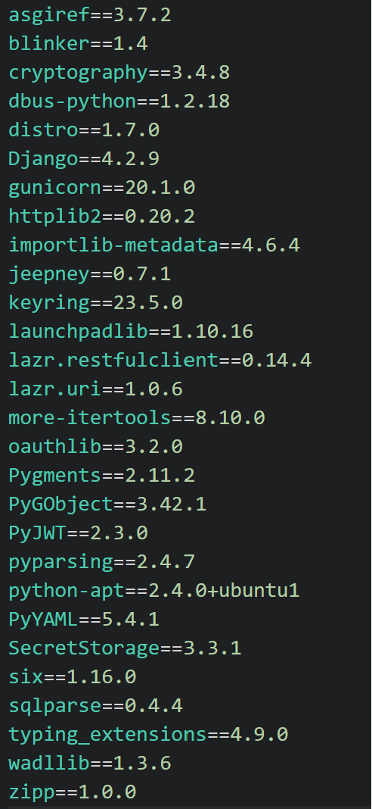

CI README 

Welcome,

This is the Code Institute student template for Codeanywhere. If you are using Gitpod then you need [this template](https://github.com/Code-Institute-Org/gitpod-full-template) instead.  We have preinstalled all of the tools you need to get started. It's perfectly ok to use this template as the basis for your project submissions.

You can safely delete this README.md file, or change it for your own project. Please do read it at least once, though! It contains some important information about Codeanywhere and the extensions we use. Some of this information has been updated since the video content was created. The last update to this file was: **August 30th, 2023**

## Codeanywhere Reminders

To run a frontend (HTML, CSS, Javascript only) application in Codeanywhere, in the terminal, type:

`python3 -m http.server`

A button should appear to click: _Open Preview_ or _Open Browser_.

To run a frontend (HTML, CSS, Javascript only) application in Codeanywhere with no-cache, you can use this alias for `python3 -m http.server`.

`http_server`

To run a backend Python file, type `python3 app.py`, if your Python file is named `app.py` of course.

A button should appear to click: _Open Preview_ or _Open Browser_.

In Codeanywhere you have superuser security privileges by default. Therefore you do not need to use the `sudo` (superuser do) command in the bash terminal in any of the lessons.

To log into the Heroku toolbelt CLI:

1. Log in to your Heroku account and go to _Account Settings_ in the menu under your avatar.
2. Scroll down to the _API Key_ and click _Reveal_
3. Copy the key
4. In Codeanywhere, from the terminal, run `heroku_config`
5. Paste in your API key when asked

You can now use the `heroku` CLI program - try running `heroku apps` to confirm it works. This API key is unique and private to you so do not share it. If you accidentally make it public then you can create a new one with _Regenerate API Key_.

---

Happy coding!